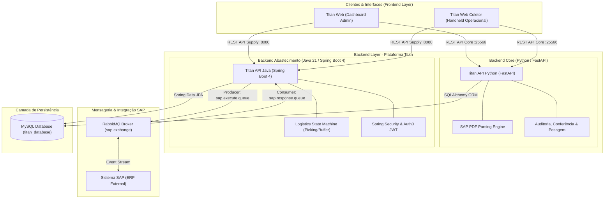
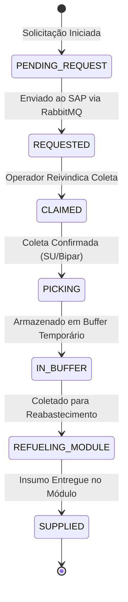

# 🚀 Titan API Java — Industrial Logistics & Supply Engine

[](https://www.oracle.com/java/)
[](https://spring.io/projects/spring-boot)
[](https://www.rabbitmq.com/)
[](https://www.mysql.com/)
[](https://www.docker.com/)

O **Titan API Java** é um microsserviço de alta performance desenvolvido para gestão de abastecimento industrial, separação de materiais (*picking*) e integração assíncrona com ERP (SAP). Atuando como o módulo de logística e picking da plataforma **Titan** em conjunto com a **Titan API (Python)** — que atua como o backend core —, a aplicação gerencia todo o ciclo de vida dos insumos em linhas de produção automatizadas e armazéns inteligentes.

---

## 📌 Principais Destaques de Arquitetura

- **☕ Java 21 & Spring Boot**: Utilização de recursos modernos da linguagem (Records, Pattern Matching, Stream API otimizada) e Spring Framework para alta escalabilidade.
- **⚡ Event-Driven**: Comunicação assíncrona orientada a eventos via **RabbitMQ** com tópicos e filas dedicadas (`sap.execute.queue` / `sap.response.queue`) para integração com o ERP SAP.
- **🔒 Segurança Stateless & RBAC**: Autenticação via **JWT (Auth0)** e Autorização Baseada em Funções (**RBAC**) com validação de perfis (`ADMIN`, `OWNER`, `CHECKER`, `OPERATOR`, `ASSISTANT`) via Spring Security.
- **⚡ Otimização com MapStruct**: Mapeamento de DTOs em tempo de compilação sem *reflection*, garantindo execução com overhead mínimo.
- **📊 Rastreabilidade e Auditoria Completa**: Registro detalhado dos operadores que coletaram, movimentaram e abasteceram cada insumo com timestamps de precisão.

---

## 🏗️ Arquitetura do Sistema

O ecossistema Titan é composto por dois backends especializados, integrados via mensageria assíncrona e APIs RESTful:



---

## 🔄 Fluxo de Vida do Insumo (State Machine)

Para garantir integridade em ambientes industriais, cada requisição de material passa por estados rigorosamente definidos:



---

## 🛠️ Tech Stack & Bibliotecas

| Categoria | Tecnologia / Biblioteca | Descrição |
|---|---|---|
| **Linguagem** | Java 21 (JDK LTS) | Records, Sealed Classes, Pattern Matching |
| **Framework Base** | Spring Boot 4.0.5 | Core framework, DI, IoC |
| **Persistência** | Spring Data JPA / Hibernate / MySQL | ORM robusto e consultas otimizadas |
| **Mensageria** | Spring AMQP / RabbitMQ | Broker de mensagens distribuídas |
| **Segurança** | Spring Security & Auth0 Java-JWT | Autenticação JWT Stateless e RBAC |
| **Mapeamento DTO** | MapStruct 1.6.3 | Code Generation performático para DTOs |
| **Boilerplate** | Lombok | Redução de código repetitivo |
| **Validação** | Hibernate Validator | Validação rigorosa dos payloads REST |
| **Containers** | Docker & Docker Compose | Containerização leve e infraestrutura como código |

---

## 🚀 Endpoints da API REST

### 🔐 Autenticação & Usuários
- `POST /auth/login` — Autenticação de usuários e emissão do Bearer JWT Token.

### 📦 Módulo de Abastecimento (`/supply`)
| Método | Endpoint | Descrição | Permissões (RBAC) |
|---|---|---|---|
| `POST` | `/supply` | Cria uma solicitação de insumo e envia evento para o SAP | `CHECKER`, `ADMIN`, `OWNER` |
| `GET` | `/supply/list` | Lista materiais com paginação | Autenticado |
| `POST` | `/supply/claim` | Reivindica o próximo material disponível para coleta | `CHECKER`, `ADMIN`, `OWNER`, `OPERATOR` |
| `POST` | `/supply/picking` | Confirma a bipagem/coleta do insumo (*picking*) | `CHECKER`, `ADMIN`, `OWNER`, `OPERATOR` |
| `POST` | `/supply/place-in-buffer` | Deposita o insumo no buffer logístico | `CHECKER`, `ADMIN`, `OWNER`, `OPERATOR` |
| `POST` | `/supply/pick-refueling/{su}` | Coleta item do buffer para reabastecer a linha | `CHECKER`, `ADMIN`, `OWNER`, `ASSISTANT` |
| `POST` | `/supply/supply-material` | Finaliza o abastecimento no módulo de destino | `CHECKER`, `ADMIN`, `OWNER`, `ASSISTANT` |
| `GET` | `/supply/{id}` | Detalhes completos do insumo + Histórico de Auditoria | `CHECKER`, `ADMIN`, `OWNER` |
| `GET` | `/supply/search` | Busca paginada por texto, status e período | `CHECKER`, `ADMIN`, `OWNER` |

---

## 💻 Como Executar o Projeto

### Pré-requisitos
- **Java 21** ou superior instalado.
- **Maven 3.9+** (ou utilizar o wrapper `./mvnw` incluído).
- **Docker & Docker Compose**.

### Opção 1: Executando a Stack Completa via Docker Compose
O projeto conta com uma pilha pronta em `docker-compose.yml` que orquestra o **RabbitMQ**, a **API Java**, a **API Python** e os **Frontends**:

```bash
# Clone o repositório
git clone https://github.com/MarcusVHO/Titan-API-Java.git
cd Titan-API-Java

# Suba todos os containers em background
docker compose up -d
```
A API estará disponível em `http://localhost:8080` e o painel do RabbitMQ em `http://localhost:15672` (User: `titan_user` / Pass: `titan_password`).

### Opção 2: Executando Localmente em Modo Desenvolvimento

1. Certifique-se de ter um banco de dados MySQL e RabbitMQ rodando (ou utilize o container de RabbitMQ do Compose):
   ```bash
   docker compose up -d rabbitmq
   ```

2. Configure as variáveis de ambiente necessárias em um arquivo `.env` ou em seu ambiente shell:
   ```env
   DB_URL=jdbc:mysql://localhost:3306/titan_database
   DB_USERNAME=root
   DB_PASSWORD=sua_senha
   RABBITMQ_HOST=localhost
   RABBITMQ_PORT=5672
   RABBITMQ_USERNAME=titan_user
   RABBITMQ_PASSWORD=titan_password
   ```

3. Compile e rode a aplicação via Maven:
   ```bash
   ./mvnw clean spring-boot:run
   ```

---

## 🎯 Padrões de Projeto & Boas Práticas Utilizadas

- **Clean Architecture & Package-by-Feature**: Estrutura modular organizada por domínio (`modules/supply`, `modules/user`, `infra/security`, `infra/messaging`), promovendo alta coesão e baixo acoplamento.
- **Global Exception Handling**: Manipulação padronizada de erros HTTP (`RestExceptionHandler`) retornando respostas consistentes baseadas em contratos REST.
- **Single Responsibility & Open/Closed Principle**: Serviços desacoplados com uso de interfaces (`SupplyService` e `SupplyServiceImpl`) e buscadores dedicados (`SupplyFinder`, `UserFinder`).
- **Data Transfer Objects (DTOs) & Imutabilidade**: Uso intensivo de **Java Records** para transmissão de dados imutáveis entre camadas.

---

## 👨‍💻 Desenvolvedor

**Marcus Vinicius H. O.**
- GitHub: [@MarcusVHO](https://github.com/MarcusVHO)
- Project Repository: [Titan-API-Java](https://github.com/MarcusVHO/Titan-API-Java)
